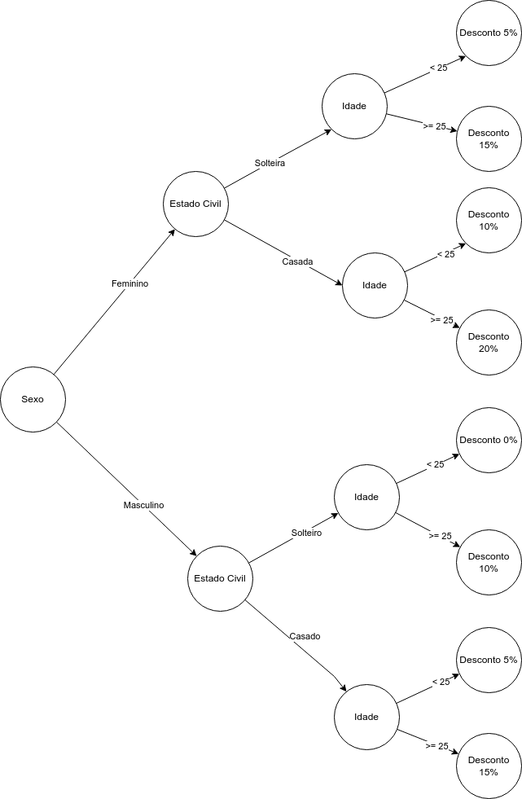
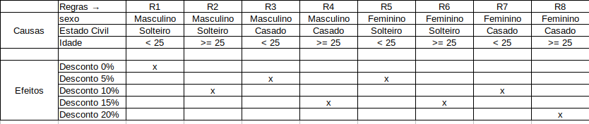

## Tarefa 005 - 08/02/2022 - Grafo de Causa e Efeito / Tabela de Decisão.

1.Considere o seguinte cenário: Uma corretora de seguros concede desconto sobre o prêmio anual de seguro de automóvel, aos seus segurados conforme as regras a seguir:
|Sexo|Idade (anos)|Estado Civil|Desconto (%)|
|---|---|---|---|
|Masculino|< 25|Solteiro|0|
|Masculino|< 25|Casado|5|
|Masculino|>= 25|Solteiro|10|
|Masculino|>= 25|Casado|15|
|Feminino|< 25|Solteira|5|
|Feminino|< 25|Casada|10|
|Feminino|>= 25|Solteira|15|
|Feminino|>= 25|Casada|20|

2. Solicita-se:
  2.1. Geração do grafo de causa e efeito para representar este cenário.
   

     
   

   2.2. Geração da tabela de decisão para representar o cenário.
   

     
   

   2.3. Geração do conjunto de casos de teste suficientes para cobrir todos os cenários, constantes do grafo e da tabela de decisão.

        2.3.1. Editar este arquivo e adicionar a tabela com os casos de teste, conforme exemplos disponibilizados em tarefas anteriores.

   2.4. Em relação aos casos de teste, considere o valor do seguro de R$ 2.000,00 (Dois mil reais). Desta forma, o valor esperado, do resultado do caso de teste, deve ser o valor líquido a ser pago. Ou seja, o prêmio deduzido do valor correspondente ao percentual do desconto obtido pelo cliente.

|CT|Sexo|Estado Civil|Idade|Valor de Entrada|Valor Esperado|
|---|---|---|---|---|---|
|CT01|FEMININO|SOLTEIRA|20|R$ 2.000,00|RS 1.900,00|
|CT02|FEMININO|SOLTEIRA|32|R$ 2.000,00|R$ 1.700,00|
|CT03|FEMININO|CASADA|19|R$ 2.000,00|R$ 1.800,00|
|CT04|FEMININO|CASADA|35|R$ 2.000,00|R$ 1.600,00|
|CT05|MASCULINO|SOLTEIRO|21|R$ 2.000,00|R$ 2.000,00|
|CT06|MASCULINO|SOLTEIRO|28|R$ 2.000,00|R$ 1.800,00|
|CT07|MASCULINO|CASADO|22|R$ 2.000,00|R$ 1.900,00|
|CT08|MASCULINO|CASADO|38|R$ 2.000,00|R$ 1.700,00|
